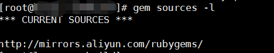
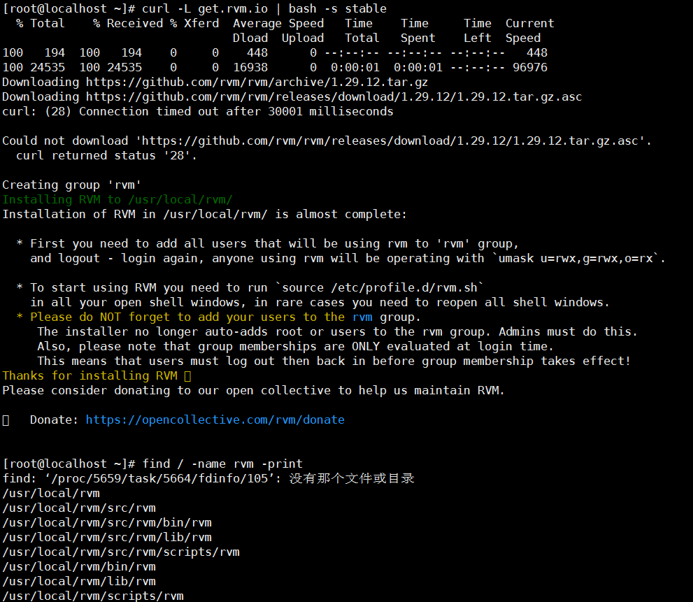
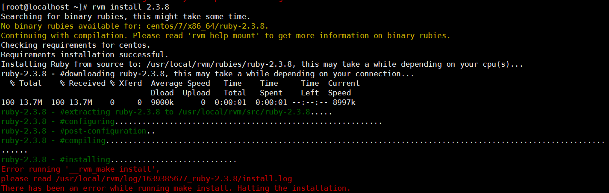
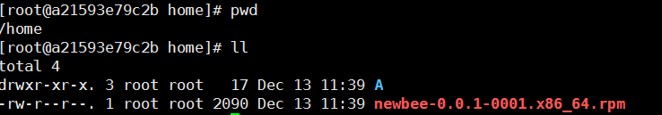
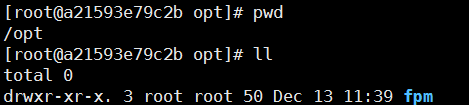

## 制作rpm 方法 

### yum ruby、rpm (failed)

[CentOS类系统]

	yum -y install ruby rubygems ruby-devel
	gem sources -l

	gem install fpm

如果还是无法使用fpm ，可能是之前安装过ruby 将路径搞乱了

	rvm install 2.5.0

安装 rvm：

	curl -sSL https://rvm.io/mpapis.asc | gpg2 --import -
	curl -sSL https://rvm.io/pkuczynski.asc | gpg2 --import -
	curl -L get.rvm.io | bash -s stable

	source /usr/local/rvm/scripts/rvm
	find / -name rvm -print

	rvm install 2.3.8

报错了

	$ ruby -v
	$ ruby 2.0.0p648 (2015-12-16) [x86_64-linux]
	gem install fpm
	ERROR:  Error installing fpm:
		git requires Ruby version >= 2.3.
	
	
	echo "$PATH"
	/usr/local/rvm/gems/ruby-2.3.8/bin:/usr/local/rvm/gems/ruby-2.3.8@global/bin:/usr/local/rvm/rubies/ruby-2.3.8/bin:/usr/local/rvm/bin
	
	
	whereis rvm
	rvm: /usr/local/rvm /usr/local/rvm/bin/rvm

	whereis gem
	gem: /usr/bin/gem /usr/local/bin/gem

	find / -name  fpm
	/usr/share/fpm
	/opt/rh/rh-ruby25/root/usr/local/share/gems/gems/fpm-1.14.1/bin/fpm
	/opt/rh/rh-ruby25/root/usr/local/share/gems/gems/fpm-1.14.1/lib/fpm
	/opt/rh/rh-ruby25/root/usr/local/bin/fpm

别人的可用的环境：

	whereis fpm
	fpm: /usr/local/rvm/gems/ruby-2.3.8/bin/fpm
	whereis gem
	gem: /usr/bin/gem /usr/local/rvm/rubies/ruby-2.3.8/bin/gem
	whereis rvm
	rvm: /usr/local/rvm /usr/local/rvm/bin/rvm

推断是装了多个版本系统环境变量错乱，(具体哪里错了没找到)

还是不行，我直接用 docker...

### docker 安装 fpm

	docker pull alanfranz/fpm-within-docker:centos-7
	docker run --name fpm5 -i alanfranz/fpm-within-docker:centos-7
	docker start a21
	[root@a21593e79c2b /]# fpm -v
	1.13.1

#### 打rpm包方法

	yum install vim
	
	cd /home
	mkdir A
	cd A
	mdkir fpm
	在 fpm 内新建一些文件

打包命令：

	fpm -s dir -t rpm -n newbee -v 0.0.1 --iteration 0001 --prefix /opt --rpm-digest md5 --architecture x86_64 --description 2021  --package /home/  -C /home/A

	-n 为 rpm name
	-v 为版本号
	--iteration 为小版本号
	-C：指定打包前的输入目录 (测试了下只能使用相对目录)
	--package：打包后rpm的路径
	--prefix 为安装后输出的目录 

生成rpm后，如果不删除，再次执行打包命令，会报错：

	File already exists, refusing to continue: /home/newbee-0.0.1-0001.x86_64.rpm {:level=>:fatal}

解压后查看/opt目录：

