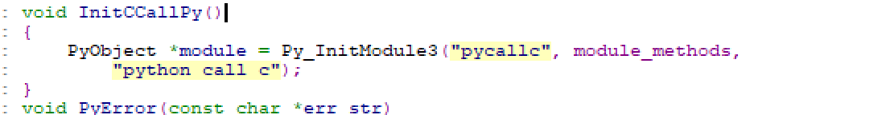
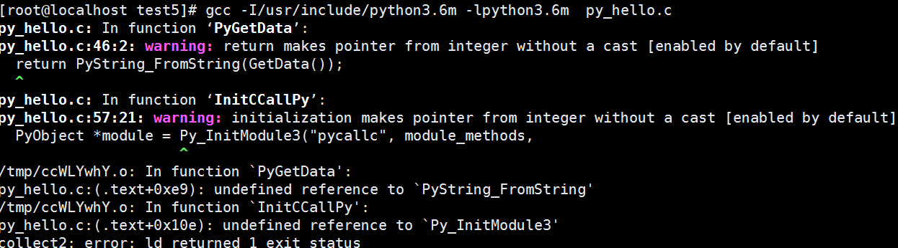
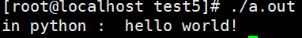
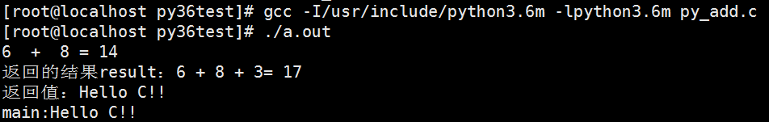
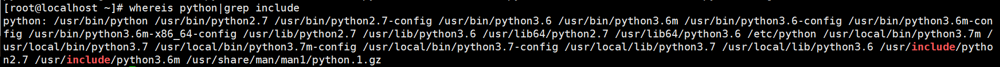
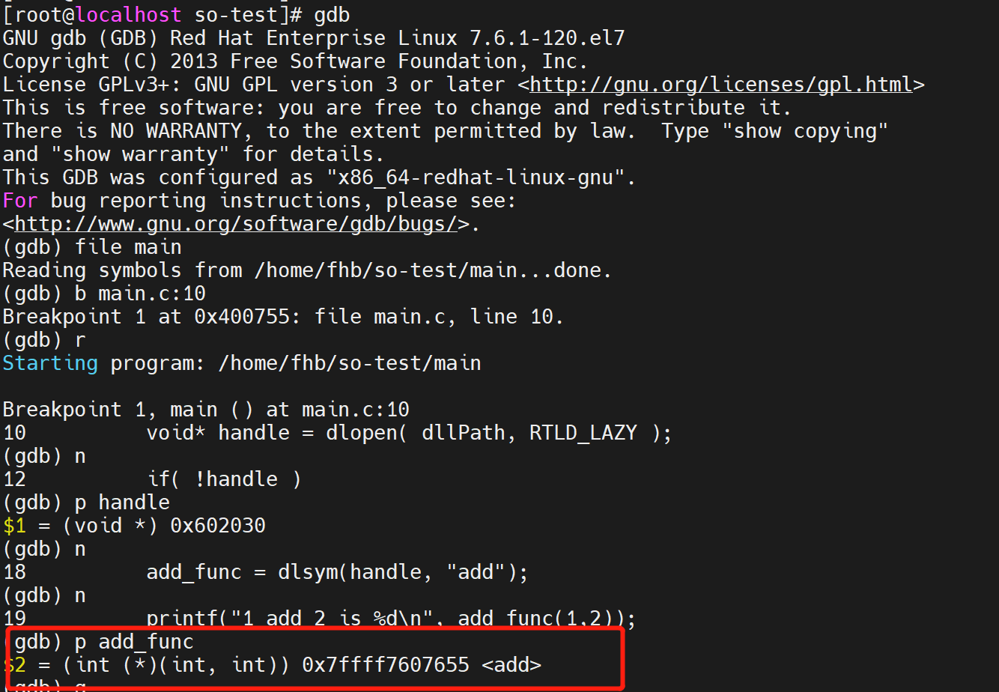
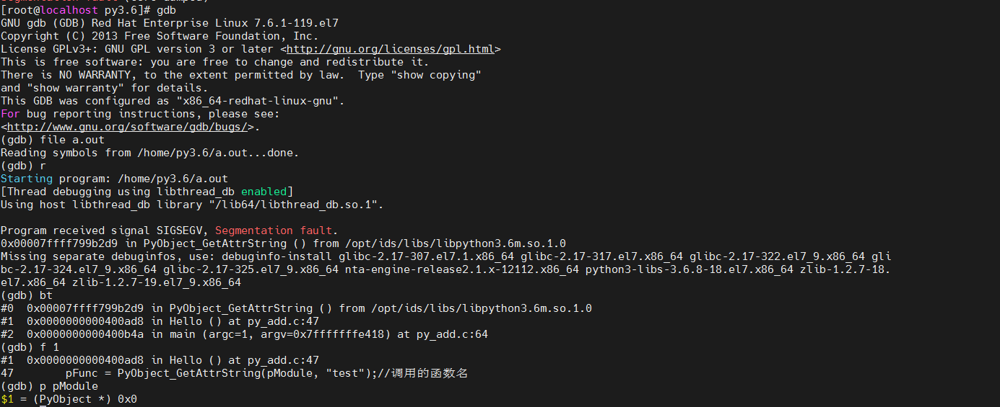

## 打包py为so

setup.py:  

	from distutils.core import setup
	from Cython.Build import cythonize
	
	setup(ext_modules = cythonize(["logrec.py"]))

 (logrec.py为要编译的py)

执行：

	python3.6 setup.py build_ext --inplace  

(在一个新文件夹build，确保build完的文件大小为300多k，重复build会导致文件变小，100k左右，甚至不可用)

上述命令分别用py3.6 和 py3.7 编译：


## 测试c能否调用py编译的so

a.c

	/* a.c */
	#include <stdio.h>
	#include <stdlib.h>
	int main()
	{
	        FILE *f;
	        char s[1024];
	        int ret;
	
	        f = popen("python3.7 hello.py", "r");
	        while((ret=fread(s,1,1024,f))>0) {
	                fwrite(s,1,ret,stdout);
	        }
	        fclose(f);
	        return 0;
	}

编译
	
	gcc -fPIC -shared -I/usr/include/python3.6m a.c -o a.so      

（用上面方法编译的 so 找不到）

hello.py

	# -*- coding:utf-8 -*-
	import logrec
	def test():
	   plain = logrec.log().getcontent()
	   return plain

main.c

	#include <stdio.h>
	#include <stdlib.h>
	#include <dlfcn.h>
	
	int main() {
	 
	    void *handler;
	    handler= dlopen("./a.so",RTLD_LAZY);
	    
	    
	    int(*getcontent)()= dlsym(handler, "getcontent");
		int a= getcontent();

编译main.c 生成main 调用 a.so

	gcc -o main main.c -ldl

**测试结论：python可以调用python或c编译的so，c语言只能调用c语言编译的so。**

[C 语言 和 python 调用 .so 文件](https://www.cnblogs.com/jkred369/p/7406084.html)

## 解决方案

通过c调py代码，py调用py编译的so。

## 通过python的C API 间接调用python代码

### python2.7版本

代码在py2.7 文件夹里。这份代码实现了py和c的互相调用。

pycallc 模块为 c代码里调用，供py使用。




如果用py3.6 编译：

	gcc -I/usr/include/python3.6m -lpython3.6m  py_hello.c

会报错：

Py_InitModule3



因为py2和py3的接口不同

使用py2.7 编译：

	gcc -I/usr/include/python2.7 -lpython2.7 py_hello.c

	./a.out



### python3.6版本

代码在py3.6 文件夹里。这份代码实现了c调用py。

	gcc -I/usr/include/python3.6m -lpython3.6m py_add.c




## reference

[python与c互相调用](https://www.cnblogs.com/chengxuyuancc/p/5355202.html)

[Python3.6/C API](https://docs.python.org/3.6/c-api/index.html)

[Python2.7/C API](https://docs.python.org/2.7/c-api/index.html)

## 后记

实验环境 python 环境变量：



### 环境安装
	
	# 换成阿里云的yum源
	yum -y install epel-release
	yum repolist
	yum install python36 -y
	
	yum install epel-release -y
	yum install https://centos7.iuscommunity.org/ius-release.rpm -y
	yum install python36-devel -y    #gcc编译python依赖库

python-devel称为是python的开发包，其中包括了一些用C/Java/C#等编写的python扩展在编译的时候依赖的头文件等信息。比如我们在编译一个用C语言编写的python扩展模块时，因为里面会有```#include<Python.h>```等这样的语句，因此我们就需要先安装python-devel开发包。

	yum install python36-pip -y
	python3.6 -m pip install --upgrade setuptools  #解决报错invalid command 'egg_info'
	python3.6 -m pip install pycrypto

### gdb 调试



如果gdb报错：

	Reading symbols from /**/**/a.out...(no debugging symbols found)...done.

在原编译命令前加```gcc -g2 -O0```命令，如：
	
	gcc -g2 -O0 -I/usr/include/python3.6m -lpython3.6m py_add.c



bt 表示查看堆栈信息；

接下来的告警表示存在空指针。

依赖包：

	python3.6 -m pip install Cython


