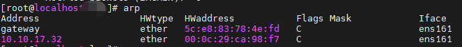
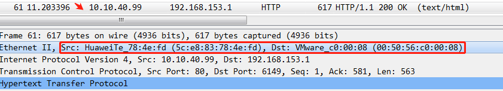

## 目标

在局域网一台机器回放数据包，到另一台机器上。

## 环境

centos

tcpreplay version: 4.3.4
	
	[root@ ~]# tcpreplay --version
	tcpreplay version: 4.3.4 (build git:v4.3.4)

## 步骤

将ip地址改为目的机器mac，并在源和目的机器抓包。

	tcprewrite --dstipmap=192.168.153.145/32:10.10.40.99/32 -i web.pcap  -o b.pcap
	tcprewrite --srcipmap=192.168.153.145/32:10.10.40.99/32 -i b.pcap  -o c.pcap

c.pcap:


tcpreplay回放并在源和目的机器抓包，源机器捕捉到数据包，目的机器不能捕捉到数据包。

**不在同一个局域网下的两台主机，修改目的MAC时，目的MAC不是目的机的网卡物理地址，而是源机器所连接的交换机的MAC地址。**

	arp



将目的mac改为网关MAC地址:

	tcprewrite -i c.pcap -o e.pcap --enet-smac=00:50:56:c0:00:08,5c:e8:83:78:4e:fd --enet-dmac=5c:e8:83:78:4e:fd,00:50:56:c0:00:08 -c a.cache

(--enet-smac 表示客户端发包的源、目的mac, --enet-dmac表示服务端发包的源、目的mac)

e.pcap:




tcpreplay回放，发现在源机器和目的机器都抓取到流量包，但 ```nc -lvp 80``` 没监测到数据：

目的机10.10.40.99，只抓取到单向请求包：


将10.10.40.99 ip 改成10.10.40.21，mac 改成网关MAC，发现40.99还是可以抓取到客户端请求的单向数据包：


tcpreplay回放只是把数据包发出去，数据包去往何处，根据的是目标mac地址。对于客户端->服务端的流量，目标为服务端，所以这个方向的流量会发往服务端。而对于服务端->客户端的流量，此时目标为客户端，所以这个方向的流量，不会发往服务端，而是在客户端。

## 原理

简单地说, tcprewrite 就是改写 pcap 包里的报文头部, 包括 2 层, 3 层, 4 层，即 MAC 地址、IP 地址和PORT 等。

tcpreplay 只保证能把包送出去, 至于包真正能到达的地址, 还是根据原来的包的 IP 和 mac，
如果是在同一网段，可能需要把 mac 地址改成测试设备的 mac，如果需要经过网关, 就得将 IP 地址改为测试设备的 IP 以及端口号 。


上图是一个基本的组网架构，用户接入汇聚核心，最后才是外网。


百兆是FE，千兆是GE，万兆是XGE。


一般是这样的，先去二层交换机里查mac地址块，去三层网关查就慢了，本地的arp -a有最好，没有也不影响，因为怎么都要经过二层交换机的。只要在一个广播域里交换机都能学习到，arp、dhcp等协议都会发广播或组播包。


## reference

https://blog.csdn.net/weixin_44275663/article/details/108245746

[tcpliveplay](http://tcpreplay.appneta.com/wiki/tcpliveplay.html)

[巧用Tcpreplay重写攻击流量](http://blog.chinaunix.net/uid-16865301-id-97411.html)

[发包利器scapy](https://blog.csdn.net/yuwen_dai/article/details/81358872)

## 离线装tcpreplay

https://blog.csdn.net/ohhpo/article/details/44827623