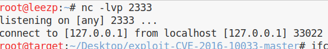
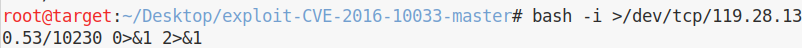

内网映射

内网映射（内网项目映射外网）

需要工具：Sunny-Ngrok

[Sunny-Ngrok官网](https://www.ngrok.cc/)

下载对应版本。


注册用户，在开通隧道页开通一个免费的ngrok服务器，按照提示填写信息（http://www.sunnyos.com/article-show-67.html）


打开下载的Sunny-Ngrok文件夹，

cmd 输入 	```sunny clientid 隧道id```

隧道id在网站隧道管理页面查看


如下图映射成功


在本地8081端口发布网站，在浏览器访问分配给我们的域名，成功访问网页。

在网站管理页面查看到网站已上线


web界面127.0.0.1:4040就是web界面的展示，到时候调试请求出问题了可以通过这里查看详细的错误或日志


免费版的查看网页速度可以，有数据库操作就比较慢了，毕竟是免费的。。

内网项目必须处于发布状态，如内网服务器关闭或结束Sunny-Ngrok程序，隧道会处于下线状态，网站无法访问。


### 局域网控公网靶机


ngrok做映射


攻击机开启监听



靶机 反弹shell,端口填 ngrok 端口映射分配的隧道端口，ip填ngrok分配域名解析的ip


