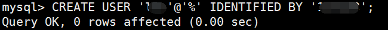

centos 7 初始配置

查看 vps 信息

cat /etc/os-release


安装gcc

yum -y install gcc

安装zlib依赖

yum install -y zlib zlib-devel --setopt=protected_multilib=false


安装zlib

yum -y install zlib*

yum -y install python3

下载python3 并make install

建立软连接

ln -s /usr/local/python3/bin/python3 /usr/bin/python3

查看版本

python3 -V

安装 httpie

httpie 是一个 httpclient 工具，能帮助我们快速的进行http请求，类似于curl但是语法做了很多简写

```pip install httpie```

use： ```http get baidu.com```

安装jdk 1.8

yum search java |grep jdk|grep java-1.8.0


yum install -y java-1.8.0-openjdk

安装 apache 服务

yum install httpd -y

启动apache服务

	 systemctl start httpd.service

查看apache状态
	
	 systemctl status httpd.service

**在浏览器输入ip访问，如果无法访问，在防火墙添加规则**

centos7 默认预装 firewall 防火墙；

您可输入命令： systemctl status firewalld 查看状态

firewall-cmd --list-port 查看已放通的端口

另外 在控制台还有安全组 限制，如果需要访问某端口，在防火墙开启的状态下 ，设置规则，还需在安全组 入方向添加对应的端口，才可以正常访问

systemctl status firewalld

systemctl start firewalld


	firewall-cmd --list-all

添加入站端口规则

	firewall-cmd --zone=public --add-port=80/tcp --permanent

不关闭服务重载防火墙

	firewall-cmd --reload

如需关闭入站端口规则
	
	firewall-cmd --zone=public --remove-port=80/tcp --permanent

发现还是不行，问华为云客服，客服说  安全组的设置只能在console 界面 **Sys-default安全组** 修改，这一点腾讯云做的就不错。因为有时候我可能手机连terminal，登陆网页console太麻烦


<br/>


用新买的华为云服务器查看开放端口，发现默认开启了一个postfix邮件服务器，客服居然说默认不开放！腾讯云服务器没有默认开启这个服务

把服务停掉

	service postfix stop

[Centos7安装Apache Http服务器无法访问如何解决](https://blog.csdn.net/u010447234/article/details/63253448)

安装mysql (我这里装的mysql5.7)

在CentOS7中默认安装有MariaDB，这个是MySQL的分支，但为了需要，还是要在系统中安装MySQL，而且安装完成之后可以直接覆盖掉MariaDB。

	wget -i -c http://dev.mysql.com/get/mysql57-community-release-el7-10.noarch.rpm
	yum -y install mysql57-community-release-el7-10.noarch.rpm
	yum -y install mysql-community-server


我的腾讯云服务器还装了一个 php-mysql-5.4.16-46.el7.x86_64
 

启动mysql

systemctl start  mysqld.service

查看mysql状态

systemctl status mysqld.service

查看mysql密码，可生成一个临时密码

	grep "password" /var/log/mysqld.log


用查到的密码登陆

修改密码(因为有密码策略，所以改一个稍微复杂的)

ALTER USER 'root'@'localhost' IDENTIFIED BY 'new password';

查看密码规则

SHOW VARIABLES LIKE 'validate_password%';


可以修改密码规则这样可以设置一些简单密码

	mysql> set global validate_password_policy=0;


	mysql> set global validate_password_length=1;


卸载 rpm 防止 mysql yum update时自动更新mysql

yum -y remove mysql57-community-release-el7-10.noarch

查看mysql 用户 登陆用户名 host

	use mysql;


添加一个新用户给远程连接权限；给特定数据库的 增，改，查权限。

创建新用户 ('%'表示允许远程连接)

	CREATE USER 'a'@'%' IDENTIFIED BY '1';



未分配权限 默认可以查看 information_schema 数据库所有表。


分配用户权限参考 

https://blog.csdn.net/jasonzds/article/details/78117178

查看mysql 写本地文件路径

SELECT @@global.secure_file_priv; 或 SHOW VARIABLES LIKE "secure_file_priv";


一般默认都是这个路径。如果为NULL，即不允许导入导出。

或者直接查看完整的


修复方法：

windows下：修改my.ini 在[mysqld]内加入```secure_file_priv =```

linux下：修改my.cnf 在[mysqld]内加入```secure_file_priv =```

安装php

CentOs 7.X 添加源
	
	rpm -Uvh https://dl.fedoraproject.org/pub/epel/epel-release-latest-7.noarch.rpm
	rpm -Uvh https://mirror.webtatic.com/yum/el7/epel-release.rpm
	rpm -Uvh https://mirror.webtatic.com/yum/el7/webtatic-release.rpm

安装php （5.6）,如果想升级到7.0把上面的56w换成70w就可以了。


yum install php56w.x86_64 php56w-cli.x86_64 php56w-common.x86_64 php56w-gd.x86_64 php56w-ldap.x86_64 php56w-mbstring.x86_64 php56w-mcrypt.x86_64 php56w-mysql.x86_64 php56w-pdo.x86_64

安装PHP FPM   (如果想升级到7.0把上面的56w换成70w就可以了。)

yum install php56w-fpm   


添加apache php 支持  （参考 https://www.cnblogs.com/yulibostu/articles/10560904.html）

	vim /etc/httpd/conf/httpd.conf

添加

	LoadModule php5_module modules/libphp5.so

在这```<IfModule mime_module>```添加

	<IfModule mime_module>

		AddType application/x-httpd-php .php
		AddType applicaiton/x-httpd-php-source .phps

在php7.2配置，只需要：

	yum install php

在这```<IfModule mime_module>```添加

	<IfModule mime_module>

		AddType application/x-httpd-php .php
		AddType applicaiton/x-httpd-php-source .phps


安装 nc:

wget https://sourceforge.net/projects/netcat/files/netcat/0.7.1/netcat-0.7.1.tar.gz

tar -zxvf netcat-0.7.1.tar.gz -C /usr/local

cd /usr/local/netcat-0.7.1

编译配置文件

	./configure
	make && make install

vim /etc/profile

	export NETCAT_HOME=/usr/local/netcat-0.7.1
	export PATH=$PATH:$NETCAT_HOME/bin

source /etc/profile

nc -h

**华为云需要同时开启防火墙入站规则端口，和web 控制台安全组添加规则**


[安装msf](https://blog.csdn.net/Aaron_Miller/article/details/80310127):


安装ruby: centos7 默认 yum 安装 ruby 2.0 ，这里需要换源安装


	yum install centos-release-scl-rh　　　　

    yum search rh-ruby25
	
	yum install rh-ruby25  -y　　　　　　

	scl  enable  rh-ruby25 bash

	ruby -v　　


因为之前安装了 别的版本 ruby， 所以每次打开shell需要指定一下 ```scl  enable  rh-ruby25 bash``` :)

<br/>

配置  gem 源

检查现在用的源

	gem sources -l
 
添加ruby-china的源，并删除掉失效的源

	gem sources --add https://gems.ruby-china.com/ --remove https://ruby.taobao.org/
 

msf5.0 依赖 bundler:1.17.3

	gem install bundler:1.17.3


	bundle install


<br/>

**这里出现一个让人头疼的错误：**


后来查找最后一个报错点，```mkmf.rb can't find header files for ruby at /opt/rh/rh-ruby25/root/usr/share/include/ruby.h```,终于找到解决方案--缺少依赖


**报错解决方案--缺少依赖 ruby-devel**

查找到 ruby 对应版本的 ruby-devel:

	yum search ruby-devel

比如我的ruby 2.5 安装对应版本的ruby-devel：

	yum install rh-ruby25-ruby-devel.x86_64

重新执行 ```bundle install``` （不报错的情况下会自动安装大量依赖）

**第二个报错又出现了**


根据报错定位到时不支持 g++ 命令，安装它

	yum install gcc-c++


重新执行 ```bundle install```

**继续报错**


这个错误我是真的搞不定 :)

<br/>

参考了第二种方法，https://www.cnblogs.com/zuoxiaolongzzz/p/11479770.html，```yum install``` 安装了如下许多依赖，还是不行。

	libxslt-devel
	libpcap-devel
	nano 
	gdbm-devel 
	patch
	libyaml-devel
	postgresql-devel


本来快要放弃了，cd 到 metasploit 目录下，再次 执行 ```bundle install```

惊喜发现，居然成功了，看来上面的依赖没有白白安装(虽然还没清楚具体是上面哪个依赖影响的，装就完事了)   &nbsp; :)


然后开始耐心等待...自动安装的依赖比较多，安装比较久...

安装成功！！！


<br/>

<br/>

安装支持包 ： yum -y install xorg-x11-server-Xvfb

下载最新版安装包 ：

wget http://downloads.metasploit.com/data/releases/metasploit-latest-linux-x64-installer.run

分配权限：

chmod +x metasploit-latest-linux-x64-installer.run

开始安装：

./metasploit-latest-linux-x64-installer.run


centos pcre 安装：

	wget https://ftp.pcre.org/pub/pcre/pcre-8.44.tar.bz2
	
	tar xjpf  pcre-8.44.tar.bz2 
	
	cd pcre-8.44
	
	./configure  --enable-utf8
	
	make && make install


安装 python pcre:

	pip install python-pcre==0.6


安装 go:

	wget https://dl.google.com/go/go1.14.1.linux-amd64.tar.gz

	tar -zxvf go1.14.1.linux-amd64.tar.gz

vim /etc/profile

	export GOROOT=/go path/go #设置为go安装路径
	export PATH=$PATH:$GOROOT/bin
	
	#export GOPATH=$HOME/go #环境变量

source /etc/profile

推荐使用 ```go mod```

## 新的阿里云服务器 53 端口被占用


https://www.itren.org/319.html

## 进程起不来

可能是硬盘不够了。

例如mysql启动不起来。

	cd /home
	du -h *

将大文件删除。

## linux 自带主机监控

audit

	service auditd status

[linux audit审计系统](https://zhuanlan.zhihu.com/p/337289840)

## reference

[vSphere虚拟交换机安全策略解读-混杂模式、MAC地址更改、伪传输](https://blog.51cto.com/u_9843231/2294188)
