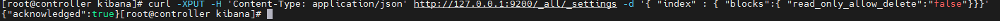
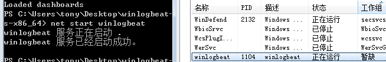
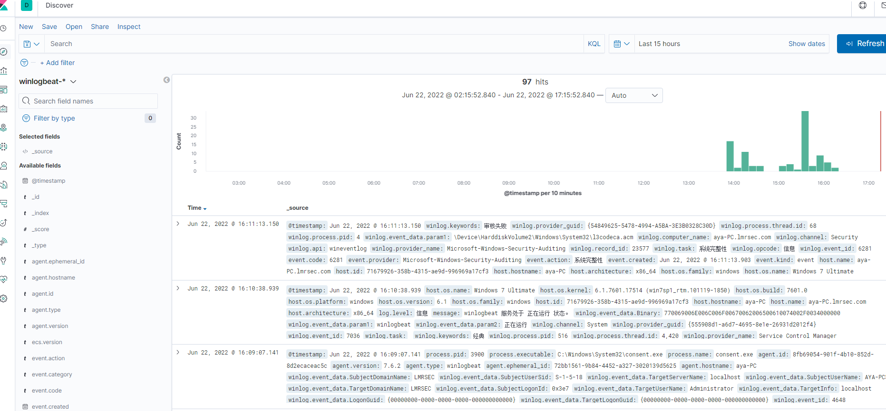
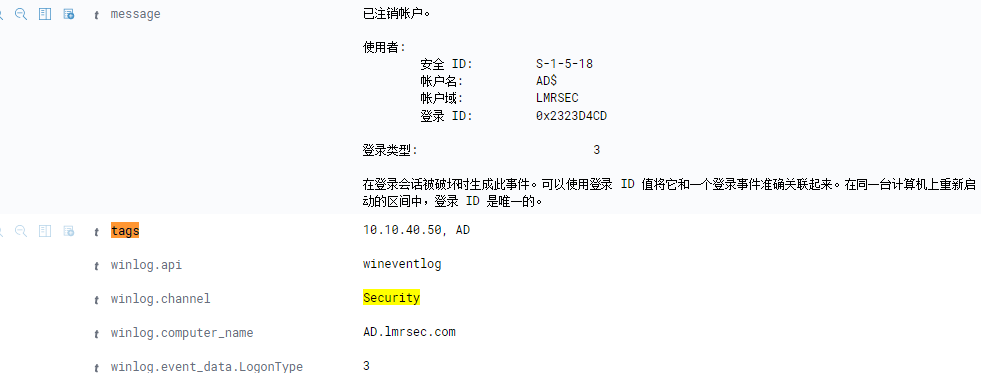

## 环境架构

windows 客户端负责采集转发

centos 服务端负责展示

winlogbeat 优点就是轻量级，因为去掉了笨重的logstash, 占用资源更少。

## 软件地址

	Elasticsearch 下载：https://www.elastic.co/downloads/elasticsearch
	
	Logstash      下载：https://www.elastic.co/downloads/logstash
	
	kibana        下载：https://www.elastic.co/downloads/kibana

	winlogbeat    下载：https://www.elastic.co/cn/downloads/past-releases#winlogbeat

安装时需要保证，组件版本一致。

## 安装ES

	wget https://artifacts.elastic.co/downloads/elasticsearch/elasticsearch-7.6.2-x86_64.rpm
	rpm -ivh elasticsearch-7.6.2-x86_64.rpm

vim /etc/elasticsearch/elasticsearch.yml

添加如下三行：
	
	network.host: 0.0.0.0
	http.port: 9200
	discovery.seed_hosts: ["0.0.0.0"]

否则启动时日志会报错：

tail -f /var/log/elasticsearch/elasticsearch.log

	[controller] the default discovery settings are unsuitable for production use; at least one of [discovery.seed_hosts, discovery.seed_providers, cluster.initial_master_nodes] must be configured

启动：

	systemctl daemon-reload
	systemctl status elasticsearch.service
	service elasticsearch start

排查启动报错的方法：

	journalctl -xe

或

	vim /var/log/elasticsearch/elasticsearch.log

## 安装kibana

	wget https://artifacts.elastic.co/downloads/kibana/kibana-7.6.2-x86_64.rpm
	rpm -ivh kibana-7.6.2-x86_64.rpm

vim /etc/kibana/kibana.yml

添加如下四行：

	server.port: 5601
	server.host: "0.0.0.0"
	elasticsearch.hosts: ["http://localhost:9200"]
	logging.dest: /var/log/kibana/kibana.log

启动：

	systemctl start kibana
	systemctl status kibana

查看进程：

	[root@controller ~]# netstat -ntlp|grep -E "9200|9300|5601"
	tcp        0      0 0.0.0.0:5601            0.0.0.0:*               LISTEN      4962/node
	tcp6       0      0 :::9200                 :::*                    LISTEN      5023/java
	tcp6       0      0 :::9300                 :::*                    LISTEN      5023/java

## 安装winlogbeat

	https://artifacts.elastic.co/downloads/beats/winlogbeat/winlogbeat-7.6.2-windows-x86_64.zip

修改 winlogbeat.yml:

	#============================== Kibana =====================================
	setup.kibana:
	  host: "10.10.40.63:5601"

	#-------------------------- Elasticsearch output ------------------------------
	output.elasticsearch:
	  # Array of hosts to connect to.
	  hosts: ["10.10.40.63:9200"]

管理员登录powershell:

安装服务：

	PowerShell.exe -ExecutionPolicy UnRestricted -File .\install-service-winlogbeat.ps1

运行测试命令检查是否出错：

	.\winlogbeat.exe test config -c .\winlogbeat.yml -e

报错:

	index [XXX] blocked by: [FORBIDDEN/12/index read-only / allow delete (api)]

原因为磁盘空间空间不足，当Elasticsearch运行时检测到磁盘空间超过了95%，为了防止节点耗尽磁盘空间，自动将索引设置为只读模式

打开Elasticsearch目录下的\config\elasticsearch.yml，添加
	
	cluster.routing.allocation.disk.watermark.flood_stage: 99%

或

	cluster.routing.allocation.disk.threshold_enabled: false

是索引只有只读和删除权限,将所有的索引设为非只读删除权限:

	curl -XPUT -H 'Content-Type: application/json' http://127.0.0.1:9200/_all/_settings -d '{ "index" : { "blocks":{ "read_only_allow_delete":"false"}}}'

清理cache:

	echo 1 > /proc/sys/vm/drop_caches

启动服务：

	net start winlogbeat

在kibana 查看日志：

	首页-Descover

## 联动win 原生日志转发监控

转发win 事件查看器 "转发事件" 日志到ES：

	winlogbeat.event_logs:
	- name: ForwardedEvents

https://www.elastic.co/guide/en/beats/winlogbeat/7.6/winlogbeat-modules.html

## reference 

https://blog.csdn.net/weixin_37450409/article/details/121362037

## 后记

如果想给转发的事件日志打一个整体的tag，可以这样配置：

	winlogbeat.event_logs:
	  - name: ForwardedEvents
	    tags: ["10.10.40.50","AD"]

