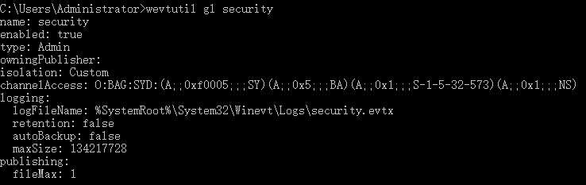

## 概述

事件查看器(eventvwr.msc)

Windows主要有以下三类日志记录系统事件：系统日志、应用程序日志和安全日志。

系统日志记录操作系统组件产生的事件，主要包括驱动程序、系统组件和应用软件的崩溃以及数据丢失错误等。系统日志中记录的时间类型由Windows NT/2000操作系统预先定义。
默认位置： %SystemRoot%\System32\Winevt\Logs\System.evtx

应用程序日志包含由应用程序或系统程序记录的事件，主要记录程序运行方面的事件，例如数据库程序可以在应用程序日志中记录文件错误，程序开发人员可以自行决定监视哪些事件。如果某个应用程序出现崩溃情况，那么我们可以从程序事件日志中找到相应的记录，也许会有助于你解决问题。
默认位置：%SystemRoot%\System32\Winevt\Logs\Application.evtx

安全日志记录系统的安全审计事件，包含各种类型的登录日志、对象访问日志、进程追踪日志、特权使用、帐号管理、策略变更、系统事件。安全日志也是调查取证中最常用到的日志。默认设置下，安全性日志是关闭的，管理员可以使用组策略来启动安全性日志，或者在注册表中设置审核策略，以便当安全性日志满后使系统停止响应。默认位置：%SystemRoot%\System32\Winevt\Logs\Security.evtx

## Windows WEF 环境配置

Windows Event Forwarding 在windows 2008时就已经启用，主要用于日志中心化收集和转储，好处很多。

## 运行条件

	一台在域控中的日志收集节点 （server 端）；
	任意一台需要发送到日志中心节点的域内主机 （client 端）；
	一个域控管理员权限用户；
	Client 端的日志读取账户权限需要开启network services 权限；
	server端开启Windows远程管理(WinRM)，同时让接收器拥有在源服务器上读取Event Log的权限。
	防火墙对域内的5985/5986端口白名单，用于日志传输。

我的环境 client PC名 AD，server PC名 tony-PC。

下面这一步不确定是否是必须项(我配置了)：

windows 的日志转发有两种方式：

	收集器已启动；
	
	源计算机已启动。

笔者只测试过第二种方法：源计算机已启动，好处是只需要开启域控到收集端的访问，无需在域控中添加账户。一旦收集端出现安全风险，在防火墙配置正确的前提下，也不会影响任何域控。

## 配置方法

client 日志发送方

server 日志收集方

### Client 端配置

1.Client 的 security log 权限查询和添加

管理员权限运行如下命令：

	wevtutil gl security

该命令是用于检查security 日志读取权限是否允许network service 读取。

返回应该是如下内容则配置成功：

	PS C:Windowssystem32>  wevtutil gl security
	...
	channelAccess: O:BAG:SYD:(A;;0xf0005;;;SY)(A;;0x5;;;BA)(A;;0x1;;;S-1-5-32-573)(A;;0x1;;;NS)

如果缺少 (A;;0x1;;;NS) 表示network service 权限没有加到security 日志项中。需要单独添加，追加 network service权限。

Client 的 security 日志的 network 权限添加:

组策略(gpedit.msc) -> 计算机配置 -> 管理模板 -> windows 组件 -> 事件日志服务器 -> 安全-> 配置日志访问

然后双击后，选择已启用，将 wevtutil gl security 中的值和(A;;0x1;;;NS)加入到配置项中 ，如

	O:BAG:SYD:(A;;0xf0005;;;SY)(A;;0x5;;;BA)(A;;0x1;;;S-1-5-32-573)(A;;0x1;;;NS)

(也有人将组策略(gpedit.msc) -> 计算机配置 -> 管理模板 -> windows 组件 -> 事件日志服务器 -> 安全-> 配置日志访问(旧版)一并配置成上面的值，影响不大，可选)

2.Client 的发送目标配置

组策略-> 计算机配置 -> 管理模板 -> windows 组件 -> 事件转发 -> 配置目标订阅管理器（即就是我们的server端地址）

选择已启用，并输入：

	Server=http://tony-PC.lmrsec.com:5985/wsman/SubscriptionManager/WEC

这里FQDN指server机器PC名。

### Server 端配置

1.打开日志收集项

使用管理员权限打开powershell 或cmd ，运行winrm qcWinRM 服务，并激活日志收集项：

2.配置日志接收项和接收的计算机

打开事件查看器(eventvwr.msc)，并选择左侧订阅：

点击创建订阅：

输入域内client机器的计算机名

添加要过滤的事件id:

等待一段时间，在 事件查看器-转发事件 查看，就有数据了。

## reference

[SIEM中心日志节点WEF搭建说明](https://cloud.tencent.com/developer/article/1808892)

[配置 Windows 事件转发](https://docs.microsoft.com/zh-cn/advanced-threat-analytics/configure-event-collection)

[构建windows 日志收集服务器](https://blog.51cto.com/tingdongwang/677124)

## 后记

1.配置完成后间隔多久会监控到转发过来的日志，这个时间不确定，如果 在“事件管理-转发事件”里，点击了 “清除日志”，则可能等待更长时间才出现日志。

“事件管理-转发事件”里还有一个功能，“筛选当前日志”，可以根据日志类型筛选。

2.后续转发过来的日志，如何分析，如何再次转发到安全设备，请看后面的博客。

3.相关的订阅流量是加密的：

4.如果想发送到域外主机，用证书也可以实现。

