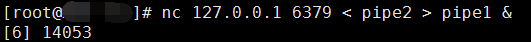
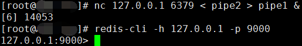
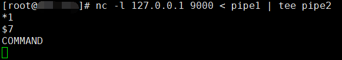
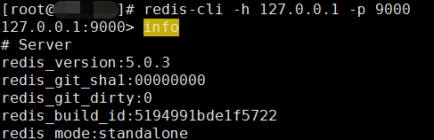
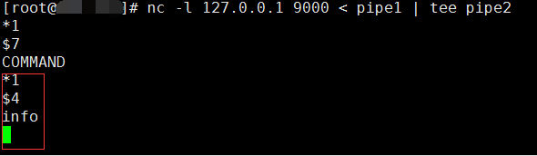

## redis 未授权


1.启动redis服务

2.创建两个管道文件：pipe1、pipe2

	$ mkfifo pipe1 
	$ mkfifo pipe2


3.切到当前目录，启动一个netcat进程监听在本地的9000端口上，以pipe1作为输入，输出重定向到tee进程，tee进程负责将数据输出到pipe2和屏幕上：

	$ nc -l 127.0.0.1 9000 < pipe1 | tee pipe2

4.启动另一个终端，切到当前目录，启动netcat进程，负责连接redis服务，以pipe2作为输入，输出重定向到pipe1中：
	
	$ nc 127.0.0.1 6379 < pipe2 > pipe1 &



5.用redis客户端连接本地9000端口：

	$ redis-cli -h 127.0.0.1 -p 9000



返回终端1 查看



6.在redis-cli中发送info命令，tee进程在终端上的输出即为整个过程需要发送给redis的数据

终端2显示：



终端1显示：



写成python字节串就是：```b'*1\r\n$4\r\ninfo\r\n'```

只需使用socket发送以上字节串即可达到同样的效果