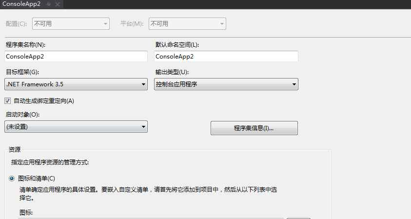
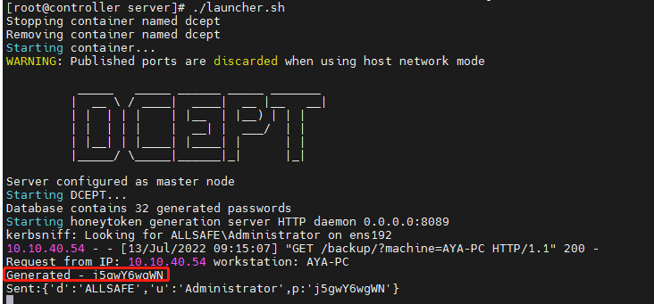
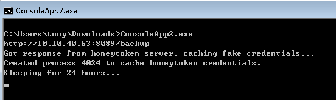
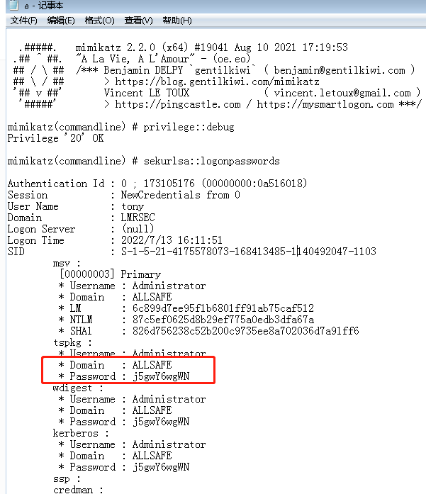
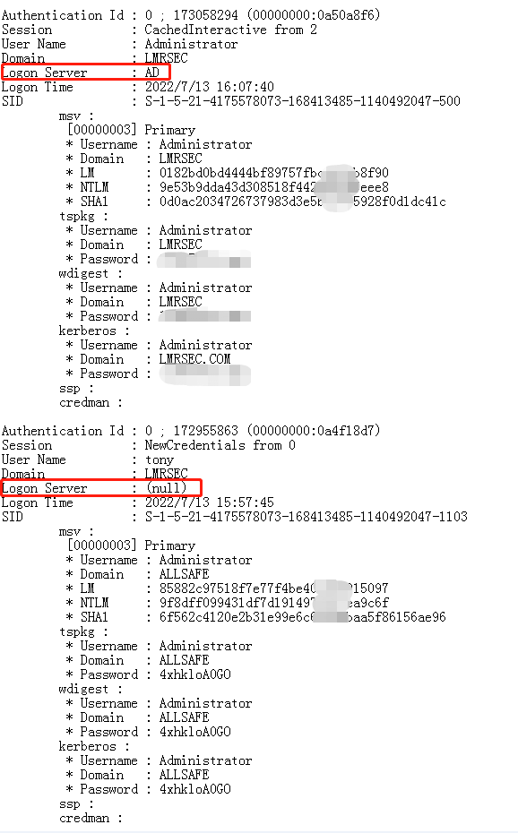
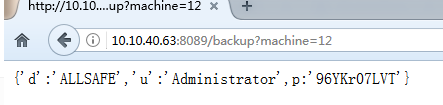
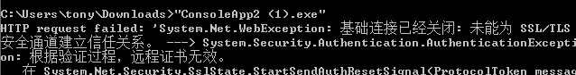

[dcept](https://github.com/secureworks/dcept/)

## 客户端构建

[System.Web.Services.dll](https://www.jb51.net/dll/System.Web.Services.dll.html#downintro2)

检查dll在当前系统是否可用的方法：

**打开cmd，输入 ```regsvr32 *.dll```，如果没有说系统不兼容，表示可以使用。**


ht-agent.cs

	using System.Web.Services;
	using System.Web.Script.Serialization;   //System.Web.Extensions.dll C:\Program Files\Reference Assemblies\Microsoft\Framework\v3.5

	const string URL="http://10.10.40.63:8089/backup";


VS 2019, 新建 "控制台应用(.NET Framework)" ，选择.NET Framework 3.5 框架 (经测试能编译成功的最低版本)。

尽量使用较低 .net framework 版本 build -release ，我使用的是 .net framework3.5 。



## 服务端构建


server 端依赖低版本 pyshark & python2

	python -m pip install pyshark==0.3.8

具体安装参考我提交的request:

	https://github.com/secureworks/dcept/pull/8/files

修改服务端配置文件(根据具体情况修改)：

	honeytoken_param_name = machine
	honeytoken_port = 8089
	interface = ens192
	domain = LMRSEC
	realm = lmrsec.com
	honey_username = Administrator

启动服务端：



启动客户端：



mimikatz 抓hash ```mimikatz privilege::debug sekurlsa::logonpasswords exit > a.txt```

可以观察到在内存里生成了多个key，重启电脑会清除 token。



比较假的是 Logon Server    NULL



http://10.10.40.63:8089/backup?machine=12



## 后记

编译完执行的时候还出过一个报错：



过一会不报错了，很奇怪。

**后面有时间需要结合winlog 看看能否发现 蜜账号被滥用**

记录 dcept server 配置


