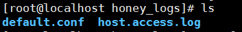
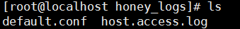
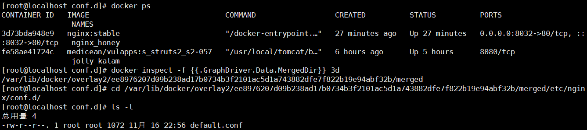
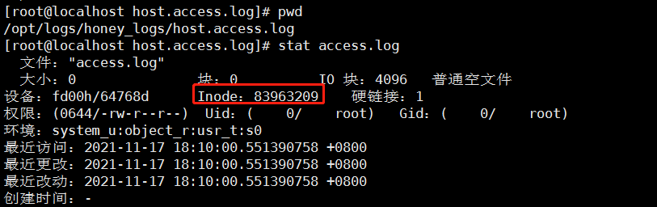
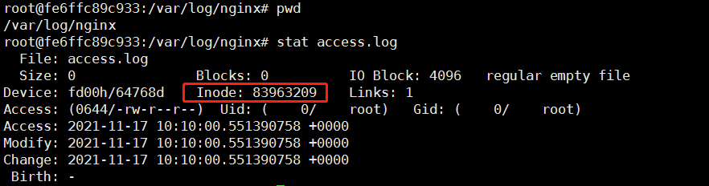

搭建蜜罐捕捉在野0day...


## 流量转发路线

vps 暴露端口 -》 nginx(docker) 反向代理转发流量到 漏洞docker -》  漏洞docker

## 实施细节

宿主机关waf，重启docker (新建docker 会自动创建防火墙策略，所以关掉防火墙重启docker，刷新配置)：

	service firewalld stop
	service docker restart 


下载漏洞docker

	docker pull medicean/vulapps:s_struts2_s2-057        
	docker run -d medicean/vulapps:s_struts2_s2-057
	apt-get update
	apt-get install netcat

172.17.0.3

下载nginx

	docker pull nginx:stable

启动，配置挂载目录

	docker run --name=nginx_honey -p 8032:80 -v /opt/logs/honey_logs/host.access.log/:/var/log/nginx/ -v /opt/logs/honey_logs/default.log/conf.d/:/etc/nginx/conf.d/ -itd docker.io/nginx:stable

执行完后，宿主机/opt/logs/honey_logs/下会有host.access.log的目录，而我们想要挂载的是一个host.access.log配置文件。docker应该是不推荐这么做的。
这个时候把宿主机host.access.log 这个目录删掉，重新建一个文档 host.access.log 再次执行启动命令就可以挂载文件了。





但是上面有一个问题，会把配置文件清空，所以**尽量挂载目录**。

我这里遇到一个问题，-v 第一个目录挂载成功，第二个目录挂载失败。这里没有搞清楚进制，一个目录成功拷贝是将容器内文件拷贝到宿主机，第二个目录拷贝失败，且还将docker容器内目录下的文件隐藏。

而且docker里面 ```/etc/nginx/conf.d/```目录下的 ```default.conf```文件没有了。

**容器里的文件只是不可见了**

	docker inspect -f {{.GraphDriver.Data.MergedDir}} ContainerID

使用下面的命令还可以发现文件在磁盘里。



所以我使用的解决方案是先将容器内目录复制到要挂载的宿主机目录，保证宿主机目录下面有完整的文件，再重新启动docker并挂载。这样子将宿主机文件挂载来拷贝到容器内是肯定不会出问题的。

	cp -rf /var/lib/docker/overlay2/ee8976207d09b238ad17b0734b3f2101ac5d1a743882dfe7f822b19e94abf32b/merged/etc/nginx/conf.d/ /opt/logs/honey_logs/default.log/

将之前的docker rm，重新执行启动命令：

	docker run --name=nginx_honey -p 8032:80 -v /opt/logs/honey_logs/host.access.log/:/var/log/nginx/ -v /opt/logs/honey_logs/default.log/conf.d/:/etc/nginx/conf.d/ -itd docker.io/nginx:stable

挂载成功！ 检查文件是否相同：

Linux中，证明文件是否相同的根本途径是，判断其 inode，如果两个文件的inode相同，两个文件必定为同一文件，从而两个文件的内容也必然相同。





接下来进入nginx 容器内部：

	apt-get update
	apt-get install vim
	apt-get install inetutils-ping
	apt-get install net-tools


	vim /etc/nginx/conf.d/default.conf

修改 nginx 配置文件 default.conf：
	
	access_log /var/log/nginx/host.access.log main;  取消注释，开启nginx日志
	
	location / {


	proxy_pass http://172.17.0.3:80/;
	}

在容器内部重启 nginx:

	service nginx restart

重启完会自动关闭docker，重新启动即可。在浏览器访问暴露的端口就会转发到漏洞docker里。


## reference

[解密 Docker 挂载文件，宿主机修改后容器里文件没有修改](https://cloud.tencent.com/developer/article/1708294)

[基于iptables的Docker网络隔离与通信详解](https://blog.csdn.net/taiyangdao/article/details/88844558)

[docker 容器保存为镜像_Docker容器和镜像操作](https://blog.csdn.net/weixin_39996496/article/details/110450200)

## 后记

对nginx日志格式的自定义：

nginx 输出 http log

https://blog.csdn.net/kangear/article/details/117879323


	vim /etc/nginx/nginx.conf


可以自定义日志格式，我这里添加 ```"$request_body"```:

	log_format  main  '$remote_addr - $remote_user [$time_local] "$request" '
                      '$status $body_bytes_sent "$http_referer" '
                      '"$http_user_agent" "$http_x_forwarded_for" "$request_body"';


Docker文件挂载时需留意：用vim进行文件的编辑并保存时，系统采用的是备份、替换的策略，文件用vim等工具编辑的过程实质是，备份原来的文件，当新文件编辑完成后，再将新文件替换文原件，这会导致文件的inode变化，所以docker内外的文件并不会同步。而用echo等重定向操作修改文件时，文件的inode保持不变，所以不会发生类似现象。

通过 DOCKER 链来控制 Docker 容器的网络访问权限:

安装完docker网络出现隔离：

	iptables -D DOCKER-ISOLATION-STAGE-2 -o br-0fd686c7709c -j DROP  (未知是否起作用)
	iptables -D DOCKER-ISOLATION-STAGE-2 -o docker0 -j DROP (起作用)

重启docker之后iptables会重新建立这些策略。